  

## 📌 About Me
- ​I am a Computer Science (BCA) student at Adhichunchanagiri University with a deep passion for building responsive, user-friendly web applications. My journey is fueled by a blend of design and code, and I am currently focused on growing into a Full-Stack Developer.
- ​🚀 Technical Skills
- ​Languages: Python, Java, C++, JavaScript.
- ​Web Technologies: HTML, CSS, React.
- ​Databases: SQL, MySQL.
- ​Specializations: Data Structures, Algorithms, Machine Learning, and IOT.
- ​🛠️ What I'm Up To
- ​I am currently learning: Advanced Full-Stack Development and refining my skills in Machine Learning and IOT.
- ​I am looking to collaborate on: Dynamic web applications, particularly projects involving React or responsive front-end design.
- ​I'm looking for help with: Expanding my knowledge in payment gateway integrations and scaling real-time applications.
- ​🏆 Featured Projects
- ​Real-time Chat Application: Developed an instant messaging platform with group chat and multimedia sharing capabilities.
- ​Award: Ranked in the Top 5% of 500 participants in a machine learning hackathon for this project.
- ​E-commerce Platform: Led the development of a full-scale retail platform including payment gateway integration and order management.
- ​Sustainable Shopping Assistant: Awarded Second Prize for the best project in a renowned tech hackathon.
- ​📫 Get in Touch
- ​Email: thejassdm1234@gmail.com
- ​Location: Chikamagalur, Karnataka
- ​Languages: Fluent in English and Kannada; Basic Hindi

## 🧠 My Focus Areas
- Web Development
- Cyber Security
- Full Stack Development

## 📊 GitHub Stats & Trophies

  
  

  

  

  

## 🛠️ Languages & Tools

> ## Programming Languages

     

> ## Frontend

     

> ## Backend

   

> ## Database

  

> ## DevOps & Cloud

    

> ## Tools

  

  

## 🔗 Connect with Me

  

  

  

